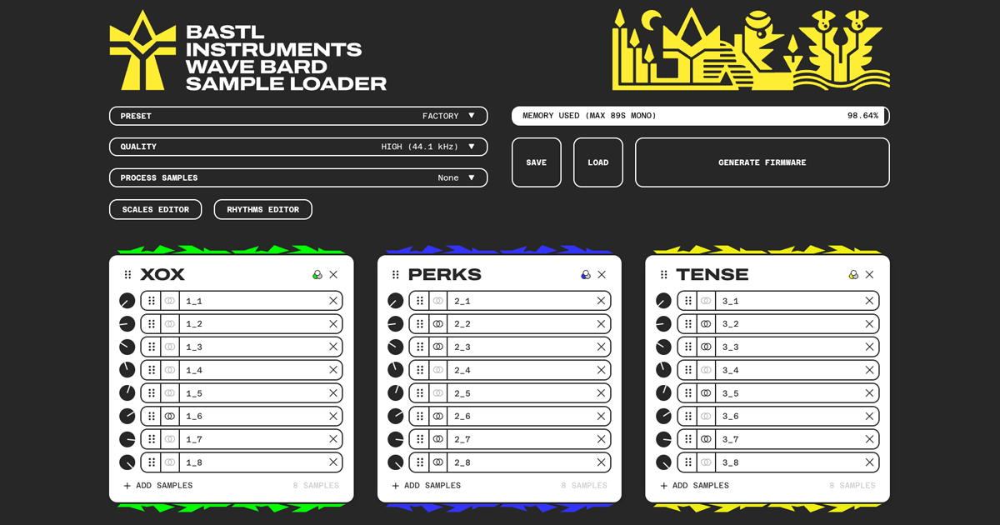

# Kastle 2 Web Apps

Web based editors for creating custom firmwares for Bastl Instruments Kastle 2 devices. Shared functionalities are: Scale Editor, Rhythms Editor. App specific: Sample Management for Wave Bard.

## Public links

[Wave Bard Sample Loader](https://apps.bastl-instruments.com/wave-bard-sample-loader/)

[Alchemist Laboratory](https://apps.bastl-instruments.com/alchemist-laboratory/)

[FX Wizard Chamber](https://apps.bastl-instruments.com/fx-wizard-chamber/)

## Readme

[Wave Bard Sample Loader README.md](./wave-bard-sample-loader/README.md)

[Alchemist Laboratory README.md](./alchemist-laboratory/README.md)

[FX Wizard Chamber README.md](./fx-wizard-chamber/README.md)

## How to develop

Written in JavaScript using React and Vite. 

Run `install.sh` which installs dependecies for each module.

Then use `run-xxx.sh` to run each app in a development mode.

When you are ready, run `build-xxx.sh` and copy the data from `dist` directories to an FTP (there is no automatic deploy).

## Credits

**Code**   
Václav Mach ([@xx0x](https://github.com/xx0x))

**Visuals**  
Anymade Studio

## License

**Code**  
MIT license

**Documentation**  
CC BY SA 4.0 license

**Graphic elements (logo and other visuals)**  
All rights reserved

**Samples (wave-bard-sample-loader/public/presets/...)**  
All rights reserved